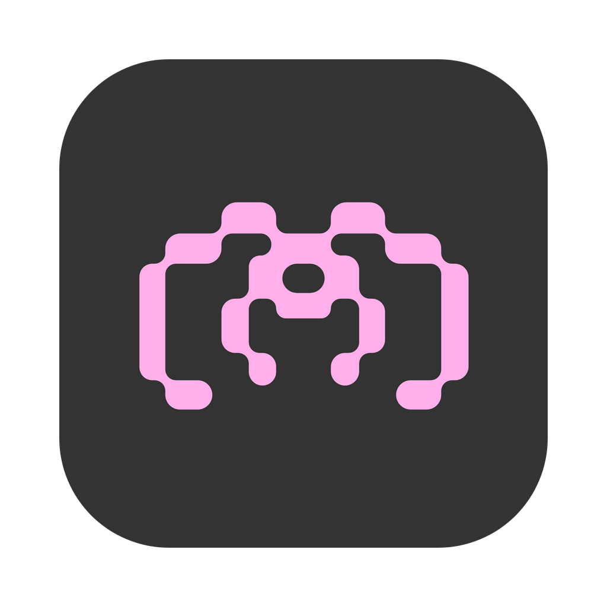
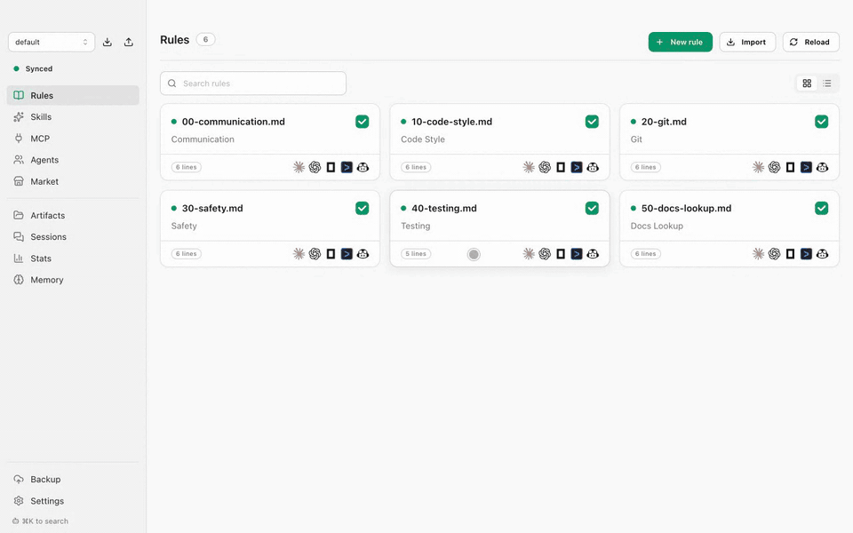
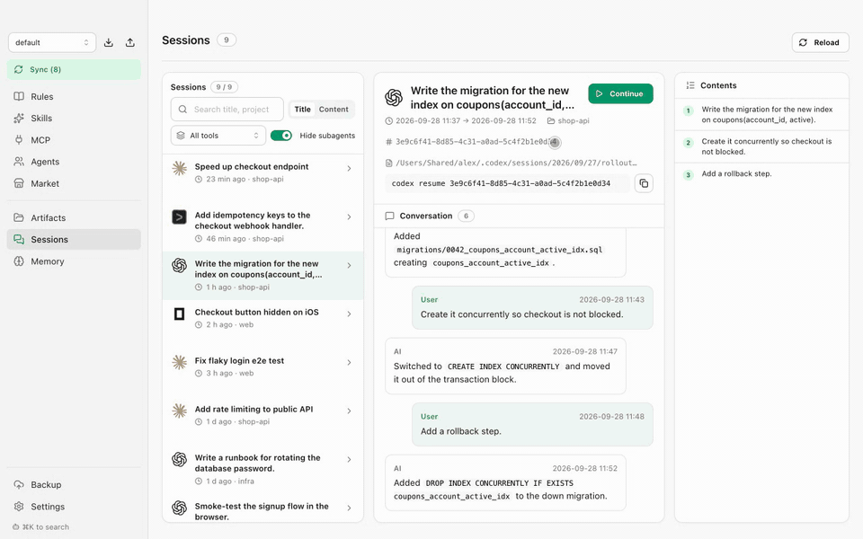
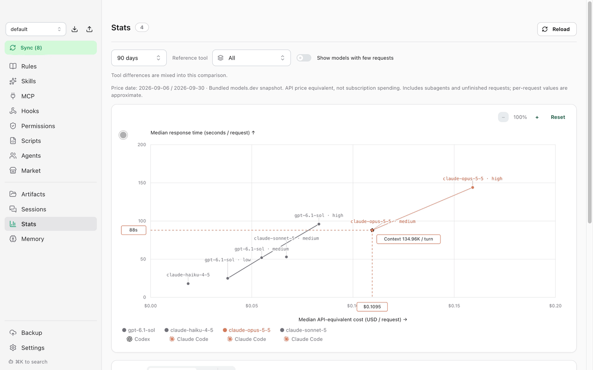
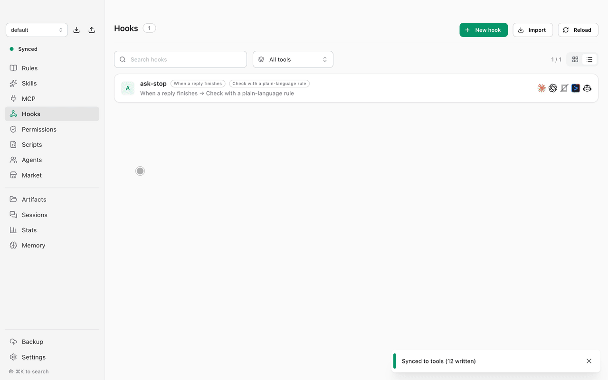
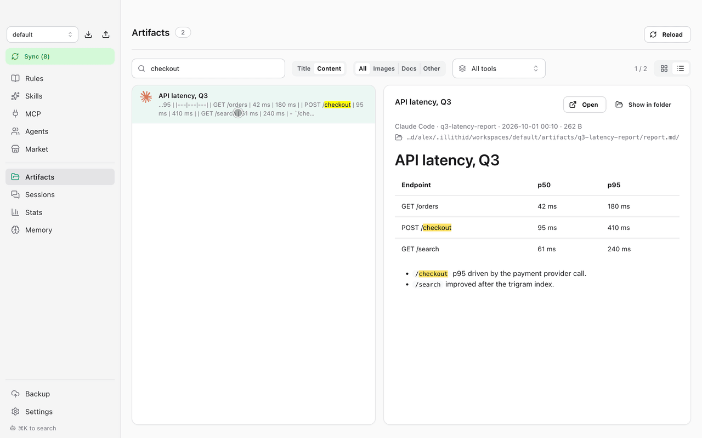

<p align="center"><a href="README.md">English</a> | <b>한국어</b> | <a href="README.ja.md">日本語</a> | <a href="README.zh-CN.md">中文</a></p>

<div align="center">
  
  <h1>Illithid</h1>
  <p><b>에이전트는 그대로. 설정은 한곳에서.</b><br>
  Claude Code, Codex, OpenCode 등 지금 쓰는 도구를 계속 사용하세요. 룰, 스킬, 서브에이전트, MCP 서버는 한곳에서 관리하세요.</p>

  <p>
    <a href="https://github.com/doominkim/illithid/releases/latest"></a>
    
    
  </p>

  <p>
    <a href="https://github.com/doominkim/illithid/releases/latest/download/illithid-arm64.dmg">Apple Silicon용 다운로드</a>
    &nbsp;·&nbsp;
    <a href="https://github.com/doominkim/illithid/releases/latest/download/illithid-x64.dmg">Intel용 다운로드</a>
  </p>
</div>

<table align="center">
  <tr>
    <td align="center"><br>Claude Code</td>
    <td align="center"><br>Codex</td>
    <td align="center"><br>OpenCode</td>
    <td align="center"><br>Gemini CLI</td>
    <td align="center"><br>GitHub Copilot</td>
    <td align="center"><br>Grok CLI</td>
  </tr>
</table>

## 한 번 설정하고, 여러 에이전트에 동기화

공통 설정을 한 번 수정하고, 변경 내용을 미리 본 뒤 사용하는 툴에 적용하세요. 룰, 스킬, 서브에이전트, MCP 서버, 훅, 권한을 툴별로 선택할 수 있습니다.

<p align="center"></p>

## 지금 쓰는 설정 그대로 가져오기

기존 설정을 가져오고, 사용할 툴을 선택하세요. 적용 전에 모든 변경을 확인할 수 있고, 가져온 원본은 Illithid가 관리하기 전에 백업됩니다.

<p align="center"></p>

## 훅으로 검사 자동화하기

훅을 한 번 만들면 Claude Code, Codex, Gemini CLI, GitHub Copilot, Grok CLI 에서 각 툴의 형식으로 실행됩니다. 실행 시점을 고르고, 직접 쓴 스크립트를 실행하거나 자연어 규칙으로 결과를 검사하세요. 여러 훅이 함께 쓰는 스크립트는 라이브러리에 두고, 보조 파일이 있는 폴더로도 만들 수 있습니다.

<p align="center"></p>

## 에이전트가 실행할 수 있는 명령 정하기

셸 명령을 허용, 물어보기, 막기 중 하나로 한 번 정하면 Illithid가 Claude Code, Codex, Gemini CLI, GitHub Copilot 에 각 툴의 형식으로 규칙을 씁니다. 관련 명령을 그룹으로 묶고, 특정 툴에서만 규칙을 끌 수 있습니다.

<p align="center"></p>

## 내 사용 기록으로 모델 비교

로컬 세션 기록에서 모델별 요청 수, 토큰 사용량, 응답 시간 중앙값을 비교하세요. 비용은 공개된 API 토큰 단가로 환산한 값이며 구독 결제액과 다릅니다. 툴과 기간을 선택해 모델과 effort 조합을 비교할 수 있습니다.

<p align="center"></p>

## 설치

```sh
brew install --cask doominkim/tap/illithid
```

또는 위에서 DMG를 받으세요.

## 그 밖의 기능

- **마켓**: 룰, 스킬, MCP 서버를 검색하고 설치합니다.
- **세션**: 지난 대화를 검색하고 이어서 작업합니다.
- **메모리**: 에이전트 메모리를 검토하고 공용 라이브러리로 올립니다.
- **산출물**: 에이전트가 만든 보고서, 문서, 이미지를 모아 봅니다.
- **워크스페이스와 백업**: 설정을 나눠 관리하고 내보내거나 가져오며, Git으로 라이브러리를 백업합니다.

## 기본값은 안전하게

- **설정 → 사용 중인 툴**에서 고른 툴에만 쓰고, 반영하기 전에 모든 변경을 미리보기로 보여줍니다.
- 교체하거나 삭제한 파일은 `~/.config/illithid/backups/`로 옮길 뿐 지우지 않습니다.
- 오래된 백업은 30일 뒤 휴지통으로 옮깁니다 (기간 변경 가능).

## 자주 묻는 질문

**코드나 프롬프트가 Illithid를 거쳐 가나요?**
아니요. Illithid는 어떤 모델 API와도 통신하지 않습니다. 로컬 설정 파일을 고치고 로컬 세션 기록을 읽을 뿐입니다. 네트워크는 Git 백업(원격을 연결했을 때만), 업데이트 확인, 마켓에서만 씁니다. 마켓은 skills.sh, 공식 MCP 레지스트리, GitHub 에 요청하며 설정에서 끌 수 있습니다. 새 버전이 나왔는지 하루에 한 번 GitHub 에 확인하며, 설정 → 업데이트에서 끌 수 있습니다.

**기존 설정을 덮어쓰나요?**
처음 실행하면 지금 쓰는 설정을 가져올지 묻습니다. 가져온 원본은 Illithid가 관리하기 전에 백업됩니다.

**그만 쓰려면 어떻게 하나요?**
앱을 종료하고 삭제하면 됩니다. Illithid가 쓴 파일은 평범한 룰, 스킬, 설정 항목이라 각 툴은 계속 동작합니다. 한 툴만 동기화를 멈추려면 설정에서 그 툴을 끄세요. 미리보기에 치울 항목이 나옵니다.

**왜 macOS만 지원하나요?**
비밀값을 macOS 키체인에 저장하기 때문에 지금은 macOS 빌드만 배포합니다.

## 소스에서 빌드

Node.js 22 이상이 필요합니다.

```sh
npm install
npm run dev          # 핫 리로드로 실행
npm run build:mac    # dist/에 DMG 생성
```

Developer ID 인증서가 없으면 `CSC_IDENTITY_AUTO_DISCOVERY=false npm run build:mac`으로 서명 없이 빌드합니다.

## 앱 언어

영어, 한국어, 일본어, 중국어.

## 라이선스

[MIT](LICENSE)
