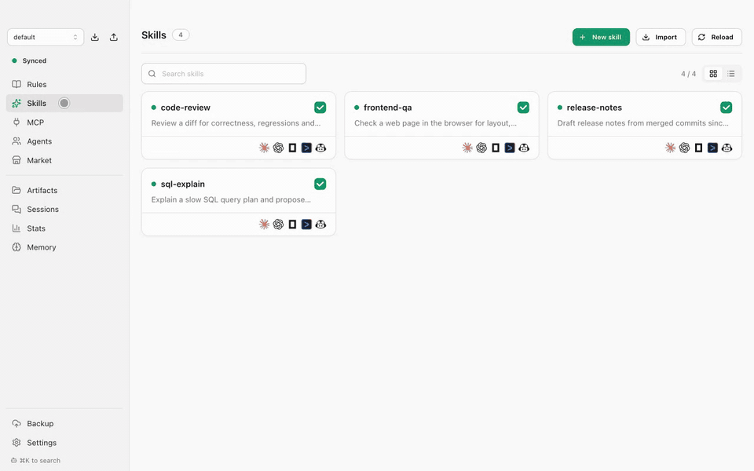
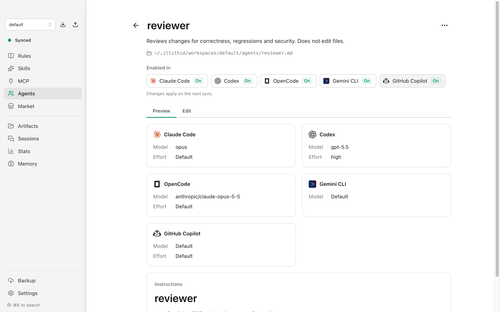
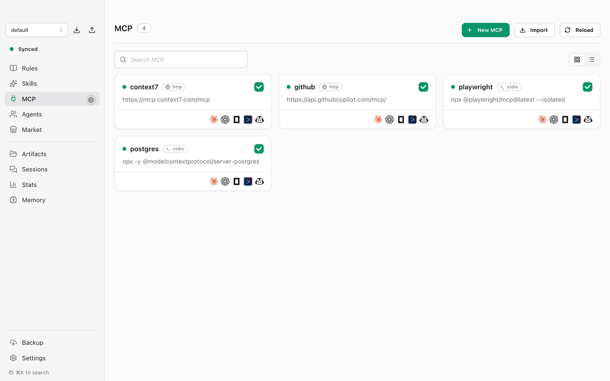
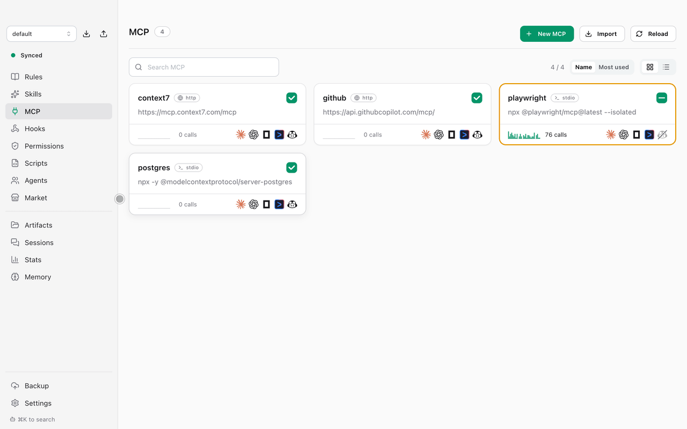
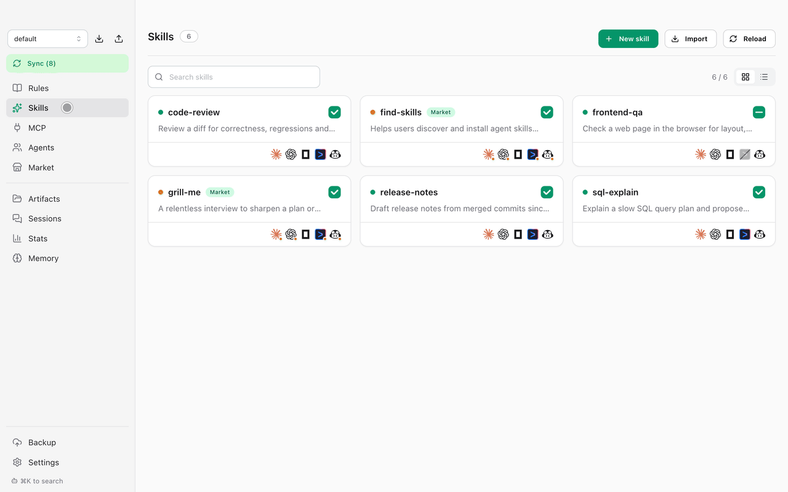
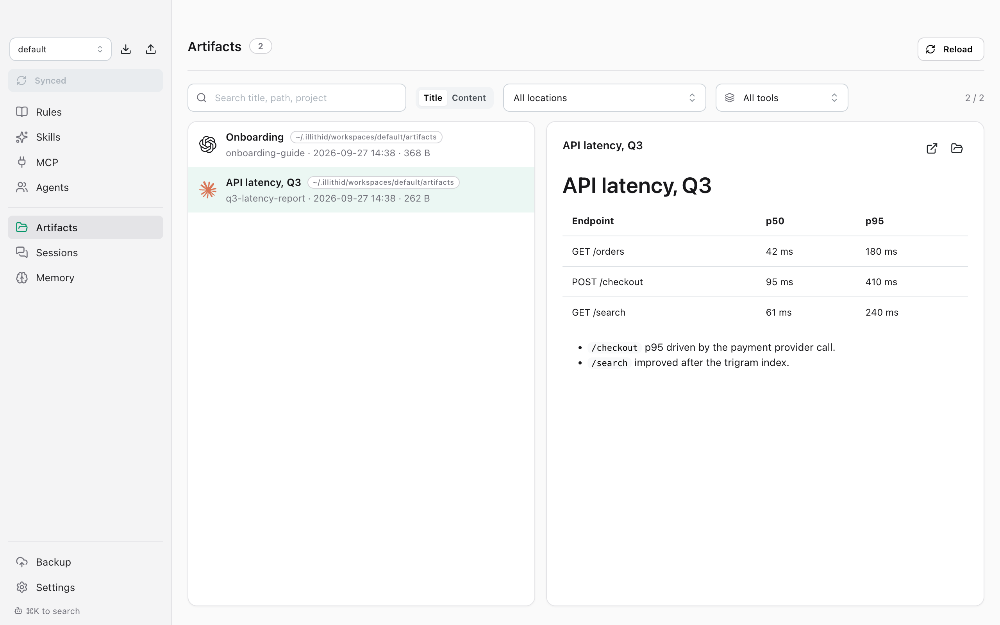

<p align="center"><a href="README.md">English</a> | <b>한국어</b> | <a href="README.ja.md">日本語</a> | <a href="README.zh-CN.md">中文</a></p>

<div align="center">
  
  <h1>Illithid</h1>
  <p><b>모든 AI 코딩 에이전트를 위한 하나의 라이브러리.</b><br>
  룰, 스킬, 서브에이전트, MCP 서버를 한 번만 작성하세요. Claude Code, Codex, OpenCode, Gemini CLI 등 각 툴에 Illithid가 맞춰 동기화합니다.</p>

  <p><sub>지원: Claude Code · Codex · OpenCode · Gemini CLI · GitHub Copilot · Grok CLI</sub></p>

  <p>
    <a href="https://github.com/doominkim/illithid/releases/latest"></a>
    
    
  </p>

  <p>
    <a href="https://github.com/doominkim/illithid/releases/latest/download/illithid-arm64.dmg">Apple Silicon용 다운로드</a>
    &nbsp;·&nbsp;
    <a href="https://github.com/doominkim/illithid/releases/latest/download/illithid-x64.dmg">Intel용 다운로드</a>
  </p>
</div>

<p align="center"></p>

## 설치

```sh
brew install --cask doominkim/tap/illithid
```

또는 위에서 DMG를 받으세요.

## 왜 필요한가

**새 모델이나 코딩 에이전트가 나올 때마다 규칙을 다시 만들고 계신가요?**<br>
**규칙 하나 바꿀 때마다 모든 에이전트 설정을 일일이 고치고 계신가요?**

툴마다 설정 위치가 다릅니다. `~/.claude/`, `~/.codex/AGENTS.md`, `opencode.json`, `~/.gemini/`, `~/.copilot/`, `~/.grok/`. 그래서 무언가 바꿀 때마다 같은 내용을 여러 곳에서 고쳐야 하고, 어느 한 곳이 어긋나기 쉽습니다.

Illithid는 이 모든 걸 한곳에서 관리합니다. 규칙을 한 번 고치면 모든 툴에 반영되고, 새 툴을 추가해도 지금 쓰는 설정 그대로 시작합니다.

Illithid는 모델을 실행하지 않고, 사용자와 에이전트 사이에 끼어들지도 않습니다. 설정 파일만 써 줄 뿐, 각 툴은 원래대로 동작합니다.

## 기능

### 룰과 스킬을 모든 툴에

룰을 한 번 고치면 사용하는 모든 툴에 반영됩니다. 특정 툴에서만 끄는 것도 클릭 한 번이면 됩니다.

<p align="center"></p>

### 툴마다 맞는 모델을 쓰는 서브에이전트

서브에이전트 정의 하나를 Claude `.md`, Codex `.toml`, OpenCode `.md`, Gemini CLI `.md`, GitHub Copilot `.agent.md`, Grok CLI `.md`로 만들어 줍니다. 툴별 모델과 effort는 ID를 입력하지 않고 목록에서 고릅니다.

<picture>
  <source media="(prefers-color-scheme: dark)" srcset="docs/screenshots/agents-dark.png">
  
</picture>

### 키가 새지 않는 MCP 서버

HTTP든 stdio든 MCP 서버는 한 번만 추가하면 됩니다. API 키는 macOS 키체인에 저장되고, 라이브러리에는 참조만 남습니다.

스킬이나 서버를 열면 최근 30일 동안 에이전트가 얼마나 호출했는지 모델별, 툴별로 보여줍니다. 로컬 세션 기록에서 셉니다.

<p align="center"></p>

### 마켓

skills.sh 스킬, MCP 레지스트리 서버, awesome-copilot 룰을 검색하고, 원하는 항목을 체크해 라이브러리에 설치합니다. 설치한 항목에는 마켓 태그가 붙습니다.

<p align="center"></p>

### 모든 세션을 검색

Claude Code, Codex, OpenCode, Gemini CLI, Grok CLI의 지난 대화를 한 목록에서 봅니다. 제목이나 내용 전체를 검색하고, 원하는 메시지로 바로 이동하고, 클릭 한 번으로 이어서 작업합니다.

<p align="center"></p>

### 쓰는 툴 고르기

**설정 → 사용 중인 툴** 에서 툴을 켜고 끕니다. 툴을 끄면 미리보기를 확인한 뒤 Illithid 가 넣어 둔 사본을 그 툴에서 치웁니다. 직접 만든 파일은 그대로 둡니다. Grok CLI 와 GitHub Copilot 은 Claude Code 의 파일도 읽기 때문에, 함께 켤 때 둘 다 쓸지 먼저 묻습니다.

<p align="center"></p>

### 산출물을 한곳에

에이전트가 만든 보고서, 문서, 이미지를 만든 툴별로 구분해 모아 봅니다.

<picture>
  <source media="(prefers-color-scheme: dark)" srcset="docs/screenshots/artifacts-dark.png">
  
</picture>

### 그 밖에

- **워크스페이스**: 회사용, 개인용처럼 설정을 나눠 두고 클릭 한 번으로 전환합니다. zip으로 내보내고 가져올 수 있습니다.
- **메모리**: Claude 자동 메모리를 검토해 쓸 만한 항목은 공용 라이브러리로 올리고, 나머지는 휴지통으로 보냅니다.
- **Git 백업**: 라이브러리를 비공개 레포에 올리고, 원하는 시점으로 복원합니다.
- **가져오기**: 이미 쓰고 있는 룰, 스킬, 서브에이전트, MCP 서버를 그대로 가져옵니다.

## 기본값은 안전하게

- **설정 → 사용 중인 툴**에서 고른 툴에만 쓰고, 반영하기 전에 모든 변경을 미리보기로 보여줍니다.
- 교체하거나 삭제한 파일은 `~/.config/illithid/backups/`로 옮길 뿐 지우지 않습니다.
- 오래된 백업은 30일 뒤 휴지통으로 옮깁니다 (기간 변경 가능).

## 자주 묻는 질문

**코드나 프롬프트가 Illithid를 거쳐 가나요?**
아니요. Illithid는 어떤 모델 API와도 통신하지 않습니다. 로컬 설정 파일을 고치고 로컬 세션 기록을 읽을 뿐입니다. 네트워크는 Git 백업(원격을 연결했을 때만)과 마켓에서만 씁니다. 마켓은 skills.sh, 공식 MCP 레지스트리, GitHub 에 요청하며 설정에서 끌 수 있습니다.

**기존 설정을 덮어쓰나요?**
처음 실행하면 지금 쓰는 설정을 가져올지 묻습니다. 가져온 원본은 Illithid가 관리하기 전에 백업됩니다.

**그만 쓰려면 어떻게 하나요?**
앱을 종료하고 삭제하면 됩니다. Illithid가 쓴 파일은 평범한 룰, 스킬, 설정 항목이라 각 툴은 계속 동작합니다. 한 툴만 동기화를 멈추려면 설정에서 그 툴을 끄세요. 미리보기에 치울 항목이 나옵니다.

**왜 macOS만 지원하나요?**
비밀값을 macOS 키체인에 저장하기 때문에 지금은 macOS 빌드만 배포합니다.

## 소스에서 빌드

Node.js 22 이상이 필요합니다.

```sh
npm install
npm run dev          # 핫 리로드로 실행
npm run build:mac    # dist/에 DMG 생성
```

Developer ID 인증서가 없으면 `CSC_IDENTITY_AUTO_DISCOVERY=false npm run build:mac`으로 서명 없이 빌드합니다.

## 앱 언어

영어, 한국어, 일본어, 중국어.

## 라이선스

[MIT](LICENSE)
