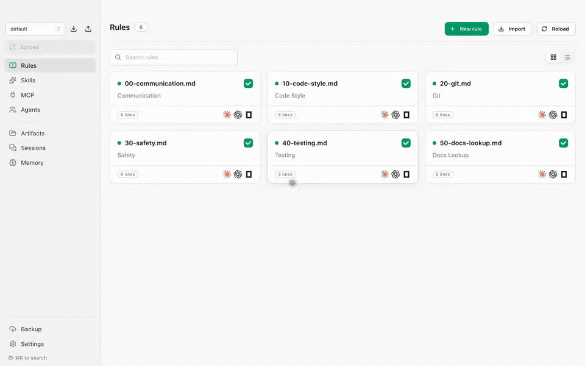
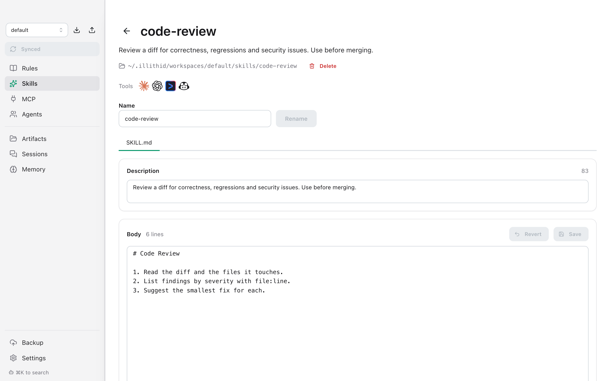
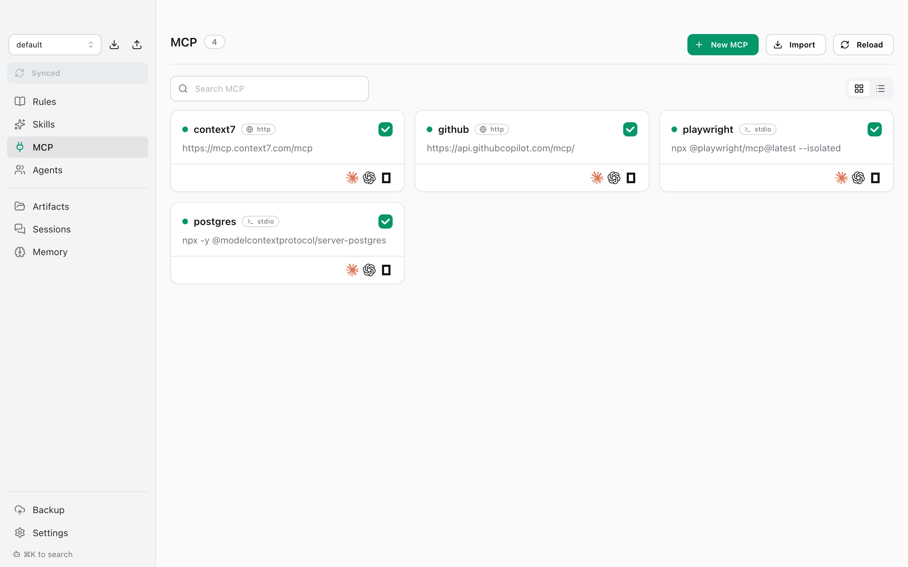
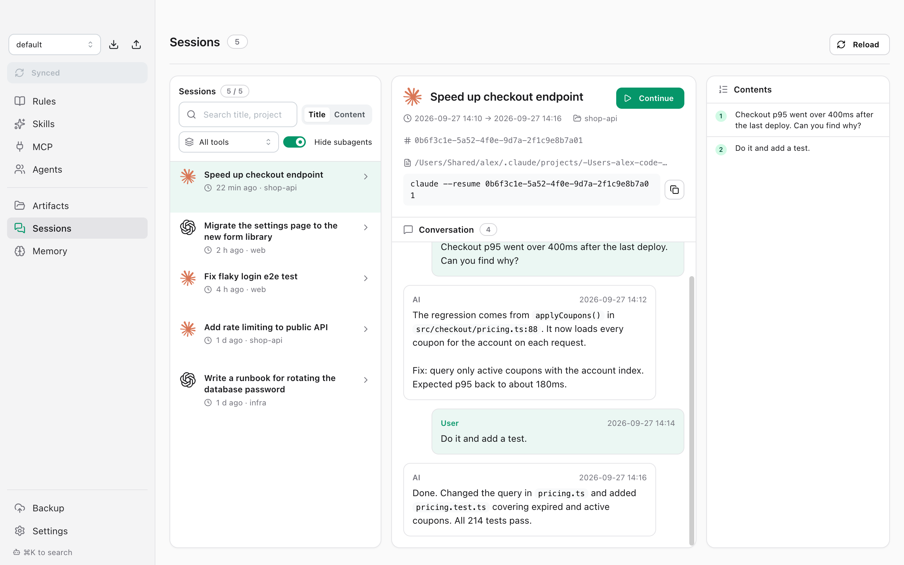

<p align="center"><b>English</b> | <a href="README.ko.md">한국어</a> | <a href="README.ja.md">日本語</a> | <a href="README.zh-CN.md">中文</a></p>

<div align="center">
  
  <h1>Illithid</h1>
  <p><b>One library for every AI coding agent.</b><br>
  Write your rules, skills, subagents and MCP servers once. Illithid keeps them in sync across Claude Code, Codex, OpenCode, Gemini CLI and more.</p>

  <p><sub>Supported: Claude Code · Codex · OpenCode · Gemini CLI · GitHub Copilot</sub></p>

  <p>
    <a href="https://github.com/doominkim/illithid/releases/latest"></a>
    
    
  </p>

  <p>
    <a href="https://github.com/doominkim/illithid/releases/latest/download/illithid-arm64.dmg">Download for Apple Silicon</a>
    &nbsp;·&nbsp;
    <a href="https://github.com/doominkim/illithid/releases/latest/download/illithid-x64.dmg">Download for Intel</a>
  </p>
</div>

<p align="center"></p>

## Install

```sh
brew install --cask doominkim/tap/illithid
```

Or download the DMG above.

## Why

**Rewriting your rules every time a new model or coding agent comes out?**<br>
**Updating every agent by hand whenever a rule changes?**

Each tool keeps its settings somewhere different: `~/.claude/`, `~/.codex/AGENTS.md`, `opencode.json`, `~/.gemini/`, `~/.copilot/`. So every change means editing the same thing in several places and hoping none of them drift.

Illithid manages it all from one place. Change a rule once and every tool gets it. Add a new tool and it starts with the setup you already have.

Illithid doesn't run models or sit between you and your agents. It only writes their config files, and each tool works as it always has.

## Features

### Rules and skills, everywhere

Edit a rule once and it lands in every tool you use. Turn any rule or skill off for a single tool with one click.

<picture>
  <source media="(prefers-color-scheme: dark)" srcset="docs/screenshots/skills-dark.png">
  
</picture>

### Subagents with the right model per tool

One subagent definition, rendered as a Claude `.md`, a Codex `.toml`, an OpenCode `.md`, a Gemini CLI `.md` and a GitHub Copilot `.agent.md`. Pick the model and effort for each tool from a list instead of typing IDs.

<picture>
  <source media="(prefers-color-scheme: dark)" srcset="docs/screenshots/agents-dark.png">
  
</picture>

### MCP servers without leaking keys

Add an MCP server once, over HTTP or stdio. API keys go into the macOS Keychain; the library only stores a reference.

<picture>
  <source media="(prefers-color-scheme: dark)" srcset="docs/screenshots/mcp-dark.png">
  
</picture>

### Every session, searchable

Browse past Claude Code, Codex, OpenCode and Gemini CLI conversations in one list. Search titles or full content, jump to any message, and resume with one click.

<picture>
  <source media="(prefers-color-scheme: dark)" srcset="docs/screenshots/sessions-dark.png">
  
</picture>

### Artifacts in one place

Reports, docs and images your agents produce, tagged by the tool that made them.

<picture>
  <source media="(prefers-color-scheme: dark)" srcset="docs/screenshots/artifacts-dark.png">
  
</picture>

### And more

- **Workspaces**: keep separate setups (work, personal) and switch in one click. Export and import as a zip.
- **Memory**: review Claude's auto-memory, promote useful entries to the shared library, trash the rest.
- **Git backup**: push the library to a private repo and restore any snapshot.
- **Import**: bring in the rules, skills, subagents and MCP servers you already have.

## Safe by default

- Illithid only writes to the tools you pick in **Settings → Tools in use**, and shows every change in a preview before applying it.
- Replaced or deleted files are moved to `~/.config/illithid/backups/`, never erased.
- Old backups go to the Trash after 30 days (configurable).

## FAQ

**Does my code or prompts go through Illithid?**
No. Illithid never talks to any model API. It edits local config files and reads local session logs. The only network access is Git backup, and only if you connect a remote.

**Will it overwrite my existing setup?**
On first run Illithid offers to import what you have. Imported originals are backed up before Illithid takes them over.

**How do I stop using it?**
Quit the app and uninstall. The files it wrote are plain rules, skills and config entries, so your tools keep working.

**Why macOS only?**
Secrets are stored in the macOS Keychain, so only macOS builds are published for now.

## Build from source

Requires Node.js 22 or newer.

```sh
npm install
npm run dev          # run with hot reload
npm run build:mac    # DMGs in dist/
```

Without a Developer ID certificate, build unsigned with `CSC_IDENTITY_AUTO_DISCOVERY=false npm run build:mac`.

## App languages

English, Korean, Japanese and Chinese.

## License

[MIT](LICENSE)
